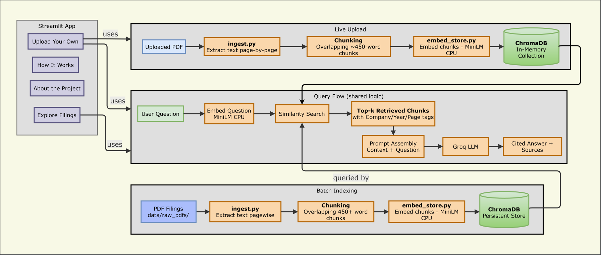

# Financial Filings RAG Analyst

A retrieval-augmented question-answering system for company annual reports
(10-K filings). It allows a user to ask natural-language questions about a
filing and receive an answer grounded in the source document, with citations
down to the exact page.

The system runs entirely on CPU, using only free, self-hostable components.
No paid API subscriptions, no GPU, and no dedicated server are required.

## Overview

The application is a multi-page Streamlit interface with the following
sections:

| Page | Purpose |
|---|---|
| **Home** | A plain-language introduction to what a 10-K is, why it matters, and how to read one. |
| **Explore Filings** | Ask questions of, or compare year-over-year trends across, a pre-built library of indexed filings. |
| **Upload Your Own** | Upload any PDF and query it live, with visible pipeline progress; nothing persists after the session ends. |
| **How It Works** | A stage-by-stage technical walkthrough of the data pipeline, from PDF input to cited answer output. |
| **About the Project** | An explanation of Retrieval-Augmented Generation (RAG), embeddings, and how the citation mechanism works. |

## Architecture


## Components

- **Text extraction** — `pdfplumber`, extracting text page by page so page
  numbers can be attached to every resulting chunk.
- **Chunking** — a simple overlapping character-window splitter, tuned to
  keep chunks small enough for precise retrieval without losing context at
  chunk boundaries.
- **Embeddings** — `sentence-transformers` (`all-MiniLM-L6-v2`), a compact
  model that runs quickly on CPU without requiring a GPU or an external API.
- **Vector storage** — `ChromaDB`, used both as a persistent, on-disk store
  and, for the upload flow, as an ephemeral in-memory store.
- **Generation** — `langchain-groq`, calling a Groq-hosted Llama model on
  its free tier, invoked only after retrieval has already narrowed the
  context to the relevant source material.
- **Interface** — `Streamlit`, structured as a multi-page application.

## Setup

### Prerequisites

- Python 3.10 or later
- A free Groq API key: https://console.groq.com (no payment method required)

### Installation

```bash
git clone <your-repo-url>
cd fin-filings-rag
python -m venv venv
source venv/bin/activate      # Windows: venv\Scripts\activate
pip install -r requirements.txt
```

Create a `.env` and set your API key.

The model used for generation can optionally be overridden by also setting
`GROQ_MODEL` in `.env`; it defaults to `llama-3.3-70b-versatile`.

### Preparing filings for the persistent library

SEC EDGAR filings are published as HTML rather than PDF. To add a filing to
the persistent library used by the "Explore Filings" page:

1. Locate the filing at https://www.sec.gov/edgar/search/
2. Open the primary document (the row marked type `10-K`)
3. Use the browser's Print function, select "Save as PDF," and ensure all
   pages are included
4. Save the file into `data/raw_pdfs/`, named as `Company_Year.pdf`
   (for example, `Citigroup_2025.pdf`) — the company and year are read
   directly from the filename

### Building the persistent index

Run once, and again whenever new filings are added:

```bash
python src/ingest.py
python src/embed_store.py
```

### Running the application

```bash
streamlit run src/app.py
```

Streamlit will print a local URL (typically `http://localhost:8501`).
The "Upload Your Own" page requires no prior indexing step — a PDF can be
uploaded and queried directly from the interface.

## Repository structure

```
fin-filings-rag/
├── data/
│   ├── raw_pdfs/          PDF filings for the persistent library
│   └── processed/         Extracted chunks (chunks.jsonl)
├── src/
│   ├── app.py             Home page (entry point)
│   ├── common.py          Shared styling and cached resource loaders
│   ├── ingest.py          Stage 1: PDF extraction and chunking
│   ├── embed_store.py     Stage 2: embedding and vector storage
│   ├── query.py           Stage 3: retrieval and answer generation
│   └── pages/
│       ├── 1_Explore_Filings.py
│       ├── 2_Upload_Your_Own.py
│       ├── 3_How_It_Works.py
│       └── 4_About_the_Project.py
├── requirements.txt
├── .env.example
└── README.md
```

## Notes

- **Metadata is never dropped.** Company, year, and page number are attached
  to every chunk at extraction time and preserved through embedding,
  storage, and retrieval — this is what makes page-level citation possible
  without any separate lookup step.
- **Generation is constrained to retrieved context.** The system prompt
  explicitly instructs the model to answer only from the provided excerpts
  and to state when an answer cannot be found, rather than relying on the
  model's own training data.
- **The upload flow and the persistent library share identical logic.**
  Extraction, chunking, and embedding are implemented once and reused by
  both entry points, so behavior cannot silently diverge between them.

## Possible extensions

- Replace the character-window chunker with a section-aware splitter that
  respects a filing's actual Item boundaries (Item 1, Item 1A, and so on).
- Add a re-ranking step (a cross-encoder model) after initial retrieval to
  improve precision on ambiguous questions.
- Add a small evaluation set of hand-labeled question/answer pairs to
  measure retrieval precision and track it as chunking parameters change.
- Swap the persistent ChromaDB store for a hosted vector database to
  demonstrate a production-oriented deployment path.
